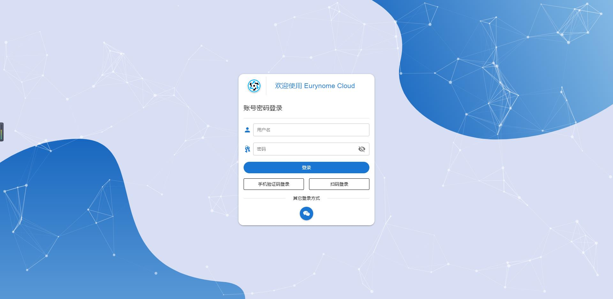
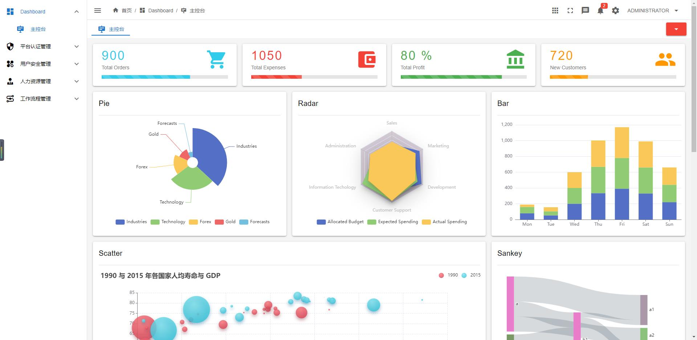
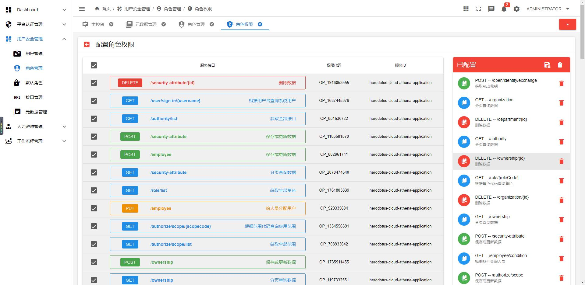

<p align="center"></p>
<h2 align="center">简洁优雅 · 稳定高效 | 宁静致远 · 精益求精 </h2>
<h4 align="center">基于 Spring Authorization Server 全新适配 OAuth 2.1 协议的企业级微服务架构</h4>

---

<p align="center">
    <a href="https://github.com/spring-projects/spring-authorization-server" target="_blank"></a>
    <a href="https://spring.io/projects/spring-boot" target="_blank"></a>
    <a href="https://spring.io/projects/spring-cloud" target="_blank"></a>
    <a href="https://github.com/alibaba/spring-cloud-alibaba" target="_blank"></a>
    <a href="https://nacos.io/zh-cn/index.html" target="_blank"></a>
</p>
<p align="center">
    <a href="#" target="_blank"></a>
    <a href="https://www.oracle.com/java/technologies/javase-downloads.html" target="_blank"></a>
    <a href="./LICENSE"></a>
    <a href="https://blog.csdn.net/Pointer_v" target="_blank"></a>
    <a href="https://gitee.com/dromara/dante-cloud"></a>
    <a href="https://gitee.com/dromara/dante-cloud"></a>
    <a href="https://gitee.com/dromara/dante-cloud"></a>
    <a href="https://gitee.com/dromara/dante-cloud"></a>
</p>
<p align="center">
    <a href="https://github.com/herodotus-cloud/dante-cloud">Github 仓库</a> &nbsp; | &nbsp;
    <a href="https://gitee.com/dromara/dante-cloud">Gitee 仓库</a> &nbsp; | &nbsp;
    <a href="https://www.herodotus.cn">文档</a>
</p>

<h1 align="center"> 如果您觉得有帮助，请点右上角 "Star" 支持一下，谢谢！</h1>

---

## 重要说明

本项目已经正式加入 `Dromara` 开源社区 【[Dromara 开源社区官网地址](https://dromara.org)】，同时项目名称也变更为 `Dante Cloud` (但丁)。因此项目地址产生了变更，需要对已检出代码的 Git 进行修改，以免影响代码的更新。如条件允许，建议使用新地址全新下载代码。给大家带来不便,敬请谅解！

谢谢大家对 `Eurynome Cloud` 支持与厚爱，希望大家继续给与 `Dante Cloud` 关注与支持。

> 项目涉及的代码包以及相关文档和说明，会在后续逐步进行变更和修改。

## 企业级技术中台微服务架构与服务能力开发平台

Dante Cloud  (但丁，原 Eurynome Cloud) 是一款企业级微服务架构和服务能力开发平台。基于 Spring Boot 2.7.4、Spring Cloud 2021.0.4、Spring Cloud Alibaba 2021.0.4.0、Spring Authorization Server 0.3.1、Nacos 2.1.1 等最新版本开发，遵循 SpringBoot 编程思想，高度模块化和可配置化。具备服务发现、配置、熔断、限流、降级、监控、多级缓存、分布式事务、工作流、多租户等功能，代码简洁，架构清晰，非常适合学习和企业作为基础框架使用。

## 平台定位

- 构建成熟的、完善的、全面的，基于 OAuth2 的、前后端分离的微服务架构解决方案。
- 面向企业级应用和互联网应用设计开发，既兼顾传统项目的微服务化，又满足互联网应用开发建设、快速迭代的使用需求。
- 平台架构使用微服务领域及周边相关的各类新兴技术或主流技术进行建设，是帮助快速跨越架构技术选型、研究探索阶段的利器。
- 代码简洁规范、结构合理清晰，是新技术开发应用的典型的、综合性案例，助力开发人员对新兴技术的学习和掌握。

## 新版前端特点：

1. 未使用任何流行开源模版，使用全新技术栈，完全纯"手写"全新前端工程。
2. 借鉴参考流行开源版本的使用和设计，新版前端界面风格和操作习惯尽量与当前流行方式统一。
3. 充份使用 Typescript 语言特性，解决大量类型校验问题，尽可能规避 "any" 式的 Typescript 编程语言使用方式。
4. 充份使用 Composition Api 和 Hooks 等 Vue3 框架新版特性进行代码编写。
5. 充份利用 Component、Hooks 以及 Typescript 面向对象等特性，抽取通用组件和代码，尽可能降低工程重复代码。
6. 对较多 Quasar 基础组件和应用功能组件进行封装，以方便代码的统一修改维护和开发使用。
7. 对生产模式下，对基于 Vite3 的工程打包进行深度性能优化。
8. 提供以 docker-compose 方式，对工程生产代码进行容器化打包和部署。

## 前端额外说明

基于 pnpm 的 monorepo 模式新版前端应用，预览尝鲜版已发布

- 该版本基于 pnpm，采用 monorepo 模式对前端工程进行重构。构建 monorepo 版本前端，是为扩展更多功能、增加应用级功能做铺垫
- 抽取 utils、components、apis、bpmn-designer 等相关代码，形成共享模块。
- 共享模块已进行优化配置，可编译成独立的组件，单独以组件形式进行发布。
- 代码以共享模块的方式进行单独维护开发，降低现有工程代码复杂度，便于后续功能的扩展和代码的复用。

> 想要尝鲜 pnpm monorepo 版本前端，请检出 dante-cloud-ui 工程中，monorepo 分支代码。

## 新版后端特点

- 基于 `Spring Authorization Server` 深度定制:

  - 基于 `Spring Data JPA`，重新构建 `Spring Authorization Server` 基础数据存储代码，替代原有 JDBC 数据访问方式，破除 `Spring Authorization Server` 原有数据存储局限，扩展为更符合实际应用的方式和设计。
  - 基于 `Spring Authorization Server`，在 OAuth 2.1 规范基础之上，增加自定义“密码”认证模式，以兼容现有基于 OAuth 2 规范的、前后端分离的应用。
  - 基于 `Spring Authorization Server`，在 OAuth 2.1 规范基础之上，增加自定义 Social Credentials 认证模式，支持手机短信验证码、微信小程序、第三方应用登录。
  - 遵照 `Spring Security 5` 以及 `Spring Authorization Server` 的代码规范，进行 OAuth2 认证服务器核心代码的开发，遵照其使用 Jackson 反序列化的方式， 增加大量自定义 Jackson Module。
  - 支持 `Spring Authorization Server` 的标准的 Token 加密校验方式外，还了增加支持自定义证书的 Token 加密方式，可通过配置动态修改
  - 支持 OAuth2 OIDC 认证模式，补充前端 OIDC 认证相关配置操作，以及对应的 /userinfo 接口调用支持 和 客户端注册支持
  - 支持 OAuth2 Authorization Code PKCE 认证模式
  - 扩展 `Spring Authorization Server` 默认的 `Client Credentials` 模式，实现 Refresh Token 的创建。
  - 扩展 `Spring Authorization Server` 默认的 `Client Credentials` 模式，实现真正的使用 Scope 权限对接口进行验证。 增加客户端 Scope 的权限配置功能，并与已有的用户权限体系解耦
  - 自定义 `Spring Authorization Server` 授权码模式登录认证页面和授权确认页面，授权码模式登录采用数据加密传输。支持多种验证码类型，暂不支持行为验证码。

- 代码结构的大规模调整和优化：
  - 对原有代码进行了深度的“庖丁解牛”，严格遵照“单一职责”原则，根据各个组件的职责以及用途，将整个工程拆解细化为多个各自独立组件模块，在最大程度上降低代码间的耦合，也更容易聚焦和定位问题。
  - 将通用化组件提取为独立工程，独立编译、按需选用，极大的降低系统主工程代码量。相关组件也已上传至 Maven 中央仓库，降低系统主工程工程代码编译耗时，改进和提升 CICD 效率，
  - 原有主工程代码结构也进行了深化调整，代码分包更加合理，代码逻辑也更加清晰。

## 后端额外说明

1. 本项目以后将主要维护 `Spring Authorization Server` 版本，原有基于 `Spring Security OAuth2` 的版本已经移至 spring-security-oauth2 分支，可以从该分支或发行版页面获取历史版本继续使用。后期会根据 ISSUE 以及使用用户反馈情况，再行决定是否继续维护 `Spring Security OAuth2` 版本。
2. 基于 Vue3、Vite3、Vuetify3、Pinia 等新版前端已发布，原有基于 Vue2、Vuetify2、Typescript 开发的前端代码已移至 vue2+vuetify2+typescript 分支
3. 自 2.7.2.3 版本起，Dante Cloud 所有核心代码全部开源。

- 新开放内容包括：

  - 接口权限鉴权：全面整合 `@PreAuthorize` 注解权限与 `URL` 权限，通过后端动态配置，无须在代码中配置 `Spring Security` 权限注解以及权限方法，即可实现接口鉴权以及权限的动态修改。采用分布式鉴权方案，规避 Gateway 统一鉴权的压力以及重复鉴权问题
  - 动态权限数据分发：采用分布式服务独立鉴权方案，`Spring Security` `@PreAuthorize` 的权限注解、权限方法以及 `URL` 权限，通过后端动态配置后，实时动态分发至对应服务。
  - User 数据策略访问：`OAuth2` `UserDetails` 核心数据支持直连数据库获取和 `Feign` 远程调用两种模式。`OAuth2` 直连数据库模式性能更优，`Feign` 访问远程调用可扩展性更强。可通过配置动态修改采用策略方式。
  - 手机短信验证码注册认证：采用自定义 `OAuth2` 授权模式，使用统一 `Token` 接口，实现手机验证码登录认证，与平台为统一体系，统一返回`OAuth2` Token，支持服务接口鉴权
  - 第三方系统社交注册认证：集成 `JustAuth`，采用自定义 `OAuth2` 授权模式，使用统一 `Token` 接口，实现基于 `JustAuth` 实现第三方系统社交登录认证，与平台为统一体系，统一返回 `OAuth2` Token，支持服务接口鉴权。所有 `JustAuth` 支持的第三方系统均支持。
  - 微信小程序注册认证：采用自定义 `OAuth2` 授权模式，使用统一 `Token` 接口，实现支持微信小程序登录认证，与平台为统一体系，统一返回 `OAuth2` Token，支持服务接口鉴权。
  - 其它方式注册认证：采用策略模式对外部系登录认证和用户注册进行接入支持，采用 `OAuth2` 默认认证接口。目前未集成的外部系统，可参考标准，适当增减参数，即可支持接入。
  - 多通道 SMS 集成：集成阿里，百度，中国移动，华为，京东，极光，网易，七牛，腾讯，又拍，云片等平台短信发送通道。可通过配置动态选择具体使用通道。支持多模版定义以及模版参数顺序控制
  - 微信小程序订阅消息：支持微信小程序订阅消息发送。提供订阅消息模版工厂，可根据自身业务需求，编写少量代码既可以拓展支持新订阅消息模版。

## 重要信息

> 不一定非要捐赠或者参与编写代码，才是参与开源项目的正确方式。点个 `Star`、提个格式规范的 ISSUE，也是在积极参与开源项目，更是对作者莫大的支持和鼓励。

> 开发新手在群内提问或新开 Issue 提问前，请先阅读 [【提问的智慧】](https://www.herodotus.cn/others/question/)，并确保认真、详细地查阅过本项目 [【在线文档】](https://www.herodotus.cn)，特别是【常见问题】章节。避免浪费大家的宝贵时间；

## [1]、总体架构


> 部分功能演示，正在逐步添加

### （1） 方法级动态权限


### （2） 服务调用链监控


### （3） 灵活定制验证码

- 滑块拼图验证码


- 文字点选验证码


## [2]、功能介绍

<a href="https://www.herodotus.cn">详情见在线文档</a>

## [3]、技术栈和版本说明

### （1）Spring 全家桶及核心技术版本

| 组件                        | 版本         |
| --------------------------- |------------|
| Spring Boot                 | 2.7.4      |
| Spring Cloud                | 2021.0.4   |
| Spring Cloud Alibaba        | 2021.0.4.0 |
| Spring Authorization Server | 0.3.1      |
| Spring Boot Admin           | 2.7.5      |
| Nacos                       | 2.1.1      |
| Sentinel                    | 1.8.5      |
| Seata                       | 1.5.2      |

> Spring 全家桶版本对应关系，详见：[版本说明](https://github.com/alibaba/spring-cloud-alibaba/wiki/%E7%89%88%E6%9C%AC%E8%AF%B4%E6%98%8E)

### （2）所涉及的相关的技术：

- 持久层框架： Spring Data Jpa & Mybatis Plus
- API 网关：Spring Cloud Gateway
- 服务注册&发现和配置中心: Alibaba Nacos
- 服务消费：Spring Cloud OpenFeign & RestTemplate & OkHttps
- 负载均衡：Spring Cloud Loadbalancer
- 服务熔断&降级&限流：Alibaba Sentinel
- 服务监控：Spring Boot Admin
- 消息队列：使用 Spring Cloud 消息总线 Spring Cloud Bus 默认 Kafka 适配 RabbitMQ
- 链路跟踪：Skywalking
- 分布式事务：Seata
- 数据缓存：JetCache + Redis + Caffeine, 自定义多级缓存
- 数据库： Postgresql，MySQL，Oracle ...
- JSON 序列化：Jackson & FastJson
- 文件服务：阿里云 OSS/Minio
- 数据调试：p6spy
- 日志中心：ELK
- 日志收集：Logstash Logback Encoder

### (3) 前端工程技术栈

- Vue3
- Vite3
- Pinia
- Typescript
- Quasar2
- Vue-Router 4
- Vueliate

## [4]、 版本号说明

本系统版本号，分为四段。

- 第一段和第二段，与 Spring Boot 版本对应，根据采用的 Spring Boot 版本变更。例如，当前采用 Spring Boot 2.4.6 版本，那么就以 2.4.X.X 开头
- 第三段，表示系统功能的变化
- 第四段，表示系统功能维护及优化情况

## [5]、工程结构

```
dante-cloud
├── configurations -- 配置文件脚本和统一Docker build上下文目录
├── dependencies -- 工程Maven顶级依赖，统一控制版本和依赖
├── module -- 依赖组件半成品拼装工程
├    ├── dante-module-common -- Module 相关模块公共辅助代码组件
├    ├── dante-module-security -- Security 相关配置代码模块组件
├    ├── dante-module-upms-logic -- UPMS 基础管理及共享代码模块组件
├    └── dante-module-upms-rest -- UPMS 基础管理接口模块组件
├── packages -- 基础核心Starter
├    ├── authorization-spring-boot-starter -- OAuth2 认证基础Starter，主要用于 UAA 认证服务器以及单体版 Dante Cloud
├    └── service-spring-boot-starter -- 平台接入应用服务通用 Starter
├── platform -- 平台核心服务
├    ├── dante-cloud-gateway -- 服务网关
├    ├── dante-cloud-monitor -- Spring Boot Admin 监控服务
├    ├── dante-cloud-upms -- 统一权限管理系统服务
├    └── dante-cloud-uaa -- 账户管理和统一认证模块
├── services -- 平台业务服务
├    ├── dante-cloud-bpmn-ability -- 工作流服务
└──  └── dante-cloud-bpmn-logic -- 工作流基础代码包
```

## [6]、项目地址

- 后端主工程地址：[https://gitee.com/dromara/dante-cloud](https://gitee.com/dromara/dante-cloud)
- 后端核心组件库地址：[https://gitee.com/herodotus/dante-engine](https://gitee.com/herodotus/dante-engine)
- 后端单体版示例工程地址：[https://gitee.com/herodotus/dante-cloud-athena](https://gitee.com/herodotus/dante-cloud-athena)
- 前端工程地址：[https://gitee.com/herodotus/dante-cloud-ui](https://gitee.com/herodotus/dante-cloud-ui)

## [7]、用户权益

- 允许免费用于学习、毕设、公司项目、私活等。
- 遵循 Apache-2.0 开源协议

## [8]、交流反馈

- 欢迎提交[ISSUS](https://gitee.com/dromara/dante-cloud/issues) ，请写清楚问题的具体原因，重现步骤和环境(上下文)
- 博客：https://blog.csdn.net/Pointer_v
- 邮箱：herodotus@aliyun.com
- QQ 群：922565573

## [9]、界面预览

<table>
    <tr>
        <td></td>
        <td></td>
        <td></td>
    </tr>
        <td></td>
        <td></td>
        <td></td>
    </tr>
        <tr>
        <td></td>
        <td></td>
        <td></td>
    </tr>
    <tr>
        <td></td>
        <td></td>
        <td></td>
    </tr>
    <tr>
        <td></td>
        <td></td>
        <td></td>
    </tr>
</table>

## [10]、鸣谢

- [Soybean Admin](https://gitee.com/honghuangdc/soybean-admin)
- [Vue Next Admin](https://gitee.com/lyt-top/vue-next-admin)
- [Vue VBen Admin](https://gitee.com/annsion/vue-vben-admin)
- [Quasar Admin Template](https://gitee.com/jinjinge/quasar-admin-template)

- 感谢 JetBrains 提供的免费开源 License：


