<p align="center">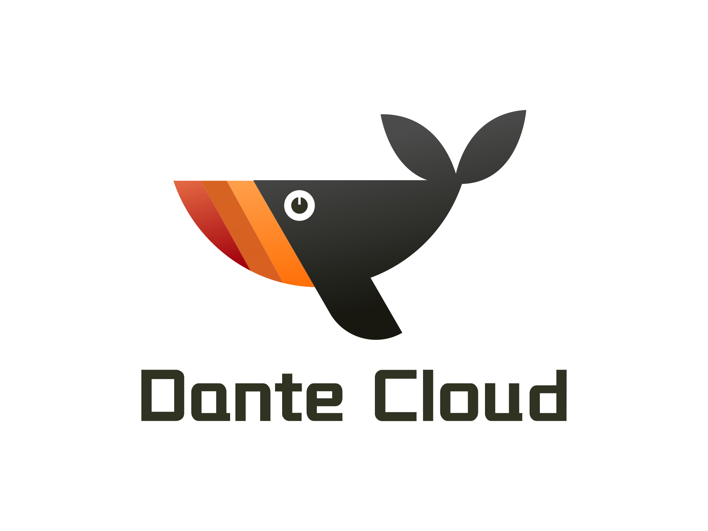</p>
<h2 align="center">简洁优雅 · 稳定高效 | 宁静致远 · 精益求精 </h2>
<h4 align="center">基于 Spring Authorization Server 全新适配 OAuth 2.1 协议的企业级微服务架构</h4>

---

<p align="center">
    <a href="https://github.com/spring-projects/spring-authorization-server" target="_blank"></a>
    <a href="https://spring.io/projects/spring-boot" target="_blank"></a>
    <a href="https://spring.io/projects/spring-cloud" target="_blank"></a>
    <a href="https://github.com/alibaba/spring-cloud-alibaba" target="_blank"></a>
    <a href="https://github.com/Tencent/spring-cloud-tencent" target="_blank"></a>
    <a href="https://nacos.io/zh-cn/index.html" target="_blank"></a>
</p>
<p align="center">
    <a href="#" target="_blank"></a>
    <a href="https://gitee.com/herodotus/dante-engine" target="_blank"></a>
    <a href="https://gitee.com/herodotus/dante-oss" target="_blank"></a>
    <a href="https://bell-sw.com/pages/downloads/#downloads" target="_blank"></a>
    <a href="./LICENSE"></a>
    <a href="https://www.herodotus.cn"></a>
    <a href="https://blog.csdn.net/Pointer_v" target="_blank"></a>
    <a href="https://gitee.com/dromara/dante-cloud"></a>
    <a href="https://gitee.com/dromara/dante-cloud"></a>
    <a href="https://gitee.com/dromara/dante-cloud"></a>
    <a href="https://gitee.com/dromara/dante-cloud"></a>
</p>
<p align="center">
    <a href="https://github.com/herodotus-cloud/dante-cloud">Github 仓库</a> &nbsp; | &nbsp;
    <a href="https://gitee.com/dromara/dante-cloud">Gitee 仓库</a> &nbsp; | &nbsp;
    <a href="https://gitee.com/herodotus/dante-engine">核心组件仓库</a> &nbsp; | &nbsp;
    <a href="https://www.herodotus.cn">文档</a>
</p>

<h1 align="center"> 如果您觉得有帮助，请点右上角 "Star" 支持一下，谢谢！</h1>

---

## 企业级技术中台微服务架构与服务能力开发平台

Dante Cloud  (但丁，原 Eurynome Cloud) 是一款企业级微服务架构和服务能力开发平台，是采用领域驱动模型(DDD)设计思想的、全面拥抱 Spring Authorization Server 的、基于 OAuth2.1 协议的、支持智能电视、IoT等物联网设备认证的微服务架构。基于 Spring Authorization Server 1.2.4、Spring Boot 3.2.5、Spring Cloud 2023.0.1、Spring Cloud Tencent 1.13.1-2023.0.0、Spring Cloud Alibaba 2023.0.0.0、Nacos 2.3.2 等主流技术栈开发的多租户系统，遵循SpringBoot 编程思想，高度模块化和可配置化。具备服务发现、配置、熔断、限流、降级、监控、多级缓存、分布式事务、工作流等功能。

## 定位

- 构建成熟的、完善的、全面的，基于 OAuth2.1 的、前后端分离的微服务架构解决方案。
- 面向企业级应用和互联网应用设计开发，既兼顾传统项目的微服务化，又满足互联网应用开发建设、快速迭代的使用需求。
- 平台架构使用微服务领域及周边相关的各类新兴技术或主流技术进行建设，是帮助快速跨越架构技术选型、研究探索阶段的利器。
- 代码简洁规范、结构合理清晰，是新技术开发应用的典型的、综合性案例，助力开发人员对新兴技术的学习和掌握。

## 背景

作者本人过往工作，主要专注企业信息化项目建设，经手过大大小小、各式各样、规模各异的项目粗略估算也有 180+。这些项目经历，足以让我体会IT行业的千滋百味。回顾过往，发现其中很多工作，特别是很多会占用技术人员大量时间和精力的工作，大多数情况下并不是像技术攻关、新技术研究、业务架构设计、并发性能调优等有挑战性的工作，而往往都是因细节考虑欠缺、代码质量不高、在用技术老旧、欠缺优化迭代、系统难于维护、项目管理不善等问题产生的需要长期投入的、低效、低意义工作。

**这也是为什么做 Dante Cloud 的初衷**：一方面是以 Dante Cloud 为载体，潜移默化地将过往项目建设的经验教训融入其中，尽可能地帮助使用者规避或者减少无效工作，提升工作效率和质量，有跟多的时间做更有意义的事情；另一方面不断地融合和使用各类新兴技术，帮助使用者尽可能多的了解、学习和运用新技术，让技术不再成为禁锢变为进步和提升的基石。

**这也是为什么 Dante Cloud 与其它项目不同**：Dante Cloud 并不过分强调常规应用功能的堆叠与丰富化，因为作者认为纯开发工作仅占整个项目建设投入的 20%，减少开发投入、提升开发效率未必就能减少整个项目建设周期剩余80%工作投入。Dante Cloud 的远景目标是可以帮助使用者缩短整个项目的建设周期和减少无意义的工作投入，而不仅仅只是在开发效率方面的提升。

> Dante Cloud 一直秉承“简洁、高效、包容、务实”的理念，不会采取任何额外的手段来获取更多的 Star，绝对真实就像其产品一样。如果你认可和喜欢 Dante Cloud，请不要吝啬你的赞美，项目右上角点颗小星星。

## 说明

因 Spring Boot 2.7.X 和 3.0.X 将分别于 2023年11月18日 和 2023年11月24日 停止维护，考虑到技术发展趋势，决定停止 Dante Cloud 2.7.X 版本代码的维护，专注 3.1.X 维护及 3.2.X 开发。2.7.16.Final 版本是 Dante Cloud 2.7.X 系列最后一个版本，代码仍旧会保留，可在工程 2.7.X 分支中获取。

## Dante Cloud 特性

### 1. 核心基础依赖便捷切换

- 新增 `Spring Cloud Tencent` 和 `Spring Cloud` 原生微服务全家桶等两种基础设施支持。
- 新增 `Spring Cloud Alibaba`、`Spring Cloud Tencent` 和 `Spring Cloud` 原生微服务全家桶三种基础设值切换能力，可以以相对便捷的方式切换使用 Alibaba、Tencent、Spring 等基础设施环境。可根据自身实际需求选择，不再局限于只能在某一种基础设施环境中运行。

### 2. `Spring Authorization Server` 全特性支持及扩展

- 基于 `Spring Authorization Server` 和 `Spring Data JPA` 实现多租户系统架构， 支持 Database 和 Schema 两种模式。
- 基于 `Spring Data JPA`，重新构建 `Spring Authorization Server` 基础数据存储代码，替代原有 JDBC 数据访问方式，破除 `Spring Authorization Server` 原有数据存储局限，扩展为更符合实际应用的方式和设计。
- 基于 `Spring Authorization Server`，在 OAuth 2.1 规范基础之上，增加自定义 `Resource Ownership Password` (密码) 认证模式，以兼容现有基于 OAuth 2 规范的、前后端分离的应用，支持 `Refresh Token` 的使用。
- 基于 `Spring Authorization Server`，在 OAuth 2.1 规范基础之上，增加自定义 `Social Credentials` (社会化登录) 认证模式，支持手机短信验证码、微信小程序、基于 `JustAuth` 的第三方应用登录， 支持 `Refresh Token` 的使用。
- 扩展 `Spring Authorization Server` 默认的 `Client Credentials` 模式，实现真正的使用 Scope 权限对接口进行验证。 增加客户端 Scope 的权限配置功能，并与已有的用户权限体系解耦
- 支持 `Spring Authorization Server` `Authorization Code PKCE` 认证模式
- 在 `Spring Authorization Server` 的标准的 `JWT Token` 加密校验方式外，支持基于自定义证书的 `JWT Token` 加密校验方式，可通过配置动态修改。
- 支持 `Opaque Token` (不透明令牌) 格式及校验方式，降低 `JWT Token` 被捕获解析的风险。可通过修改配置参数，设置默认 Token 格式是采用 `Opaque Token` 格式还是 `JWT Token` 格式。
- 全面支持 `OpenID Connect` (OIDC) 协议，系统使用时可根据使用需求，通过前端开关配置，快速切换 OIDC 模式和传统 OAuth2 模式
- 深度扩展 `Authorization Code`、`Resource Ownership Password`、`Social Credentials` 几种模式，全面融合 `IdToken`、`Opaque Token`、`JWT Token` 与现有权限体系，同时提供 `IdToken` 和 自定义 Token 扩展两种无须二次请求的用户信息传递方式，减少用户信息的频繁请求。
- 自定义 `Spring Authorization Server` 授权码模式登录认证页面和授权确认页面，授权码模式登录采用数据加密传输。支持多种验证码类型，暂不支持行为验证码。
- 新增基于 `Spring Authorization Server` 的、支持智能电视、IoT等物联网设备认证模式
- 无须在代码中配置 `Spring Security` 权限注解以及权限方法，即可实现接口鉴权以及权限的动态修改。采用分布式鉴权方案，规避 Gateway 统一鉴权的压力以及重复鉴权问题
- OAuth2 UserDetails 核心数据支持直连数据库获取和 Feign 远程调用两种模式。OAuth2 直连数据库模式性能更优，Feign 访问远程调用可扩展性更强。可通过配置动态修改采用策略方式。

### 3. 全体系化应用和开发特性集成

- 微服务架构全体系 Session 共享，实现 Spring Authorization Server、多实例服务、WebSocket、自定义 Session 以及大前端 Session 的统一。`微服务架构下的 Session 可以选择不用，但是不能没有`。
- 混合国密 `SM2` (非对称) 和 `SM4` (对称加密) 算法，实现基于数字信封技术的秘钥动态生成加密传输。利用“一人一码机制”，实现前后端数据进行动态加密传输与。Spring Authorization Server OAuth 2.1 授权模式深度融合，构建统一体系的数据传输加密。
- 全面整合 `@PreAuthorize` 注解权限与 `URL` 权限，通过后端动态配置，无须在代码中配置 `Spring Security` 权限注解以及权限方法，可实现接口鉴权以及权限的统一管理和动态修改 
- 融合 Spring Cloud Stream 和 WebSocket，以优雅的方式实现 WebSocket 服务多实例环境下，点对点、广播消息跨实例推送，在线用户实时统计，完美支持 WebSocket 集群化应用。 
- 借鉴 JPA 标准化设计思想，提取和抽象 OSS 标准化操作，形成统一的 Java OSS API 规范。封装可操作任意厂商的、统一的 REST API，构建定义统一、动态实现的应用模式（类似于 Hibernate 是 JPA 的一种实现，Hibernate 以 Dialect 方式支持不同的数据库一样），在不修改代码的情况下通过修改配置实现 OSS 的无缝切换和迁移 
- 自研基于 `JetCache` 分布式两级缓存，完美实现 JPA Hibernate 二级缓存，支持各类查询数据缓存以及 JPA `@ManyToMany`， `@ManyToOne`等关联查询。完美解决 Spring Cache 仅使用本地缓存、创建 Key 繁琐和分页数据无法更新的问题。支持多实例服务本地缓存和远程缓存数据同步，同时支持 Mybatis Plus 二级缓存
- 平台统一错误处理，支持自定义错误码体系，有效集成 `OAuth2`、`Spring Validation` 等多方错误体系并有机整合 HTTP 状态码。采用 Customizer 模式，采用错误码自动计算和创建模式，支持代码模块级错误码灵活定义扩展。响应结果更加多样灵活，反馈结果也更加人性化，便于理解和定位问题。 
- 全体系 OkHttp 、HttpClient 统一化集成，实现 OkHttp 、HttpClient 与 RestTemplate 、Openfeign 一体化融合。统一使用 Feign 配置参数，对 OkHttp 、HttpClient 进行参数设定，可策略化选择设置使用 OkHttp 或 HttpClient 作为 RestTemplate 、Openfeign 统一的基础 HttpClient

### 4. 采用 `pnpm monorepo` 重构前端

- 未使用任何流行开源模版，使用全新技术栈，完全纯"手写"全新前端工程。 
- 借鉴参考流行开源版本的使用和设计，新版前端界面风格和操作习惯尽量与当前流行方式统一。 
- 充份使用 Typescript 语言特性，解决大量类型校验问题，尽可能规避 "any" 式的 Typescript 编程语言使用方式。 
- 充份使用 Composition Api 和 Hooks 等 Vue3 框架新版特性进行代码编写。 
- 充份利用 Component、Hooks 以及 Typescript 面向对象等特性，抽取通用组件和代码，尽可能降低工程重复代码。 
- 对较多 Quasar 基础组件和应用功能组件进行封装，以方便代码的统一修改维护和开发使用。 
- 对生产模式下，对基于 Vite3 的工程打包进行深度性能优化。 
- 提供以 docker-compose 方式，对工程生产代码进行容器化打包和部署。 
- 该版本基于 pnpm，采用 monorepo 模式对前端工程进行重构。构建 monorepo 版本前端，是为扩展更多功能、增加应用级功能做铺垫 
- 抽取 utils、components、apis、bpmn-designer 等相关代码，形成共享模块。 
- 共享模块已进行优化配置，可编译成独立的组件，单独以组件形式进行发布。 
- 代码以共享模块的方式进行单独维护开发，降低现有工程代码复杂度，便于后续功能的扩展和代码的复用。

## 说明

开发新手在群内提问或新开 Issue 提问前，请先阅读 [【提问的智慧】](https://www.herodotus.cn/others/question/)，并确保认真、详细地查阅过本项目 [【在线文档】](https://www.herodotus.cn)，特别是【常见问题】章节。避免浪费大家的宝贵时间；

## [1]、总体架构

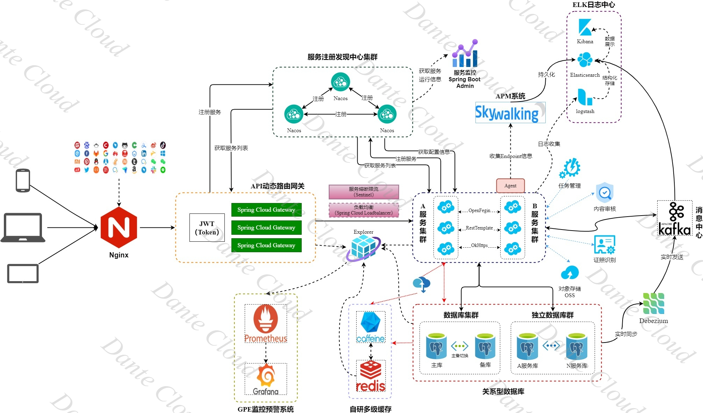

> 部分功能演示，正在逐步添加

### （1） 方法级动态权限

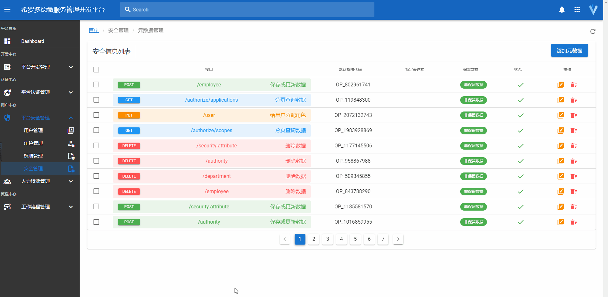

### （2） Minio 控制台使用 Dante Cloud 登录认证


### （3） 服务调用链监控

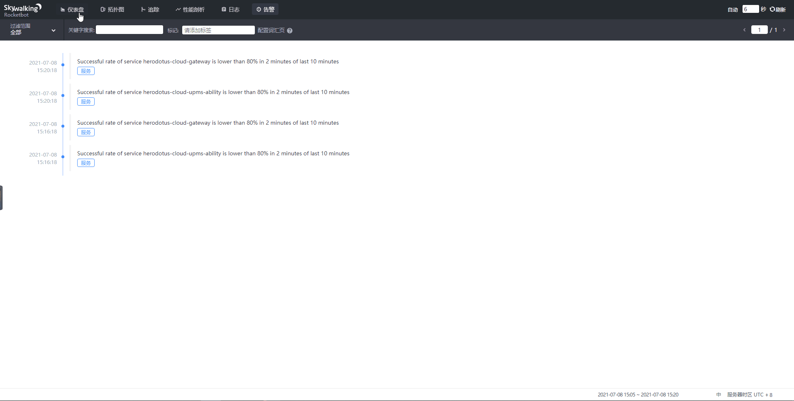

### （4） 灵活定制验证码

- 滑块拼图验证码

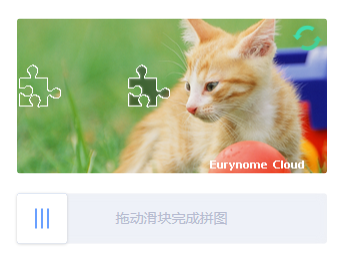

- 文字点选验证码


## [2]、功能介绍

<a href="https://www.herodotus.cn">详情见在线文档</a>

## [3]、技术栈和版本说明

### （1）Spring 全家桶及核心技术版本

| 组件                          | 版本              |
|-----------------------------|-----------------|
| Spring Boot                 | 3.2.5           |
| Spring Cloud                | 2023.0.1        |
| Spring Cloud Alibaba        | 2023.0.0.0      |
| Spring Cloud Tencent        | 1.13.1-2023.0.0 |
| Spring Authorization Server | 1.2.4           |
| Spring Boot Admin           | 3.2.2           |
| Nacos                       | 2.3.2           |
| Sentinel                    | 1.8.7           |
| Seata                       | 1.7.0           |

> Spring 全家桶版本对应关系，详见：[版本说明](https://github.com/alibaba/spring-cloud-alibaba/wiki/%E7%89%88%E6%9C%AC%E8%AF%B4%E6%98%8E)

### （2）所涉及的相关的技术：

- 持久层框架： Spring Data Jpa & Mybatis Plus
- API 网关：Spring Cloud Gateway
- 服务注册&发现和配置中心: Alibaba Nacos、Tencent Polaris
- 服务消费：Spring Cloud OpenFeign & RestTemplate & OkHttps
- 负载均衡：Spring Cloud Loadbalancer
- 服务熔断&降级&限流：Alibaba Sentinel、Tencent Polaris
- 服务监控：Spring Boot Admin
- 消息队列：使用 Spring Cloud 消息总线 Spring Cloud Bus 默认 Kafka 适配 RabbitMQ
- 链路跟踪：Skywalking
- 分布式事务：Seata
- 数据缓存：JetCache (Redis + Caffeine) 多级缓存
- 数据库： Postgresql，MySQL，Oracle ...
- JSON 序列化：Jackson & FastJson
- 文件服务：阿里云 OSS/Minio
- 数据调试：p6spy
- 日志中心：ELK
- 日志收集：Logstash Logback Encoder

### (3) 前端工程技术栈

- Vue 3
- Vite 5
- Pinia
- Typescript 5
- Quasar 2
- Vue-Router 4
- Vueliate

## [4]、 版本和分支

### 一、版本号说明

本系统版本号，分为四段。

- 第一段和第二段，与 Spring Boot 版本对应，根据采用的 Spring Boot 版本变更。例如，当前采用 Spring Boot 2.4.6 版本，那么就以
  2.4.X.X 开头
- 第三段，表示系统功能的变化
- 第四段，表示系统功能维护及优化情况

### 二、分支说明

| 分支名称                   | 对应 Spring 生态版本                          | 对应 JDK 版本 | 用途                 | 现状                                                      |
|------------------------|-----------------------------------------|-----------|--------------------|---------------------------------------------------------|
| master                 | Spring Boot 3.2 和 Spring Cloud 2023.0.1 | JDK 17    | 主要发布分支             | 可使用，但 Spring Cloud Alibaba、Tencent 等生态并未发布正式适配版，请谨慎选择使用 |
| develop                | Spring Boot 3.2 和 Spring Cloud 2023.0.1 | JDK 17    | Development 分支     | 新功能、ISSUE 均以此分支作为开发，发布后会 PR 至 master 分支。开发分支不保证可用       |
| reactive-develop       | Spring Boot 3.2 和 Spring Cloud 2023.0.1 | JDK 21    | 响应式 Development 分支 | 下一代响应式微服务版本开发分支。开发分支不保证可用                               |
| 3.1.X                  | Spring Boot 3.1 和 Spring Cloud 2022.0.X | JDK 17    | Stable 代码分支        | 稳定可用版本分支，2024年5月，Spring Boot 3.3 发布后将会停止维护              |
| 2.7.X                  | Spring Boot 2.7 和 Spring Cloud 2021.0.X | JDK 8     | 历史代码分支             | 基于 Spring Boot 2.7 时代开发的代码分支，不再维护                       |
| spring-security-oauth2 | Spring Boot 2.6 和 Spring Cloud 2021.0.X | JDK 8     | 历史代码分支             | 基于原 Spring Security OAuth2 实现的微服务，因相关组件均不在维护，所以该版本不再维护  |

## [5]、工程结构

```
dante-cloud
├── configurations -- 配置文件脚本和统一Docker build上下文目录
├── dependencies -- 工程Maven顶级依赖，统一控制版本和依赖
├── module -- 依赖组件半成品拼装工程
├    ├── dante-module-common -- Module 相关模块公共辅助代码模块
├    ├── dante-module-metadata -- 权限元数据同步模块
├    ├── dante-module-social -- 社交登录模块
├    └── dante-module-strategy -- UAA 核心数据访问策略模块
├── packages -- 基础核心Starter
├    ├── authorization-spring-boot-starter -- OAuth2 认证基础Starter，主要用于 UAA 认证服务器以及单体版 Dante Cloud
├    ├── facility-spring-boot-starter -- 基础设施切换依赖starter
├    └── service-spring-boot-starter -- 平台接入应用服务通用 Starter
├── platform -- 平台核心服务
├    ├── dante-cloud-gateway -- 服务网关
├    ├── dante-cloud-message -- 消息服务
├    ├── dante-cloud-monitor -- Spring Boot Admin 监控服务
├    ├── dante-cloud-upms -- 统一权限管理系统服务
├    └── dante-cloud-uaa -- 账户管理和统一认证模块
├── services -- 平台业务服务
├    ├── dante-cloud-bpmn-ability -- 工作流服务
├    ├── dante-cloud-bpmn-logic -- 工作流基础代码包
└──  └── dante-cloud-oss-ability -- 对象存储服务
```

## [6]、项目地址

- 后端主工程地址：[https://gitee.com/dromara/dante-cloud](https://gitee.com/dromara/dante-cloud)
- 后端核心组件库地址：[https://gitee.com/herodotus/dante-engine](https://gitee.com/herodotus/dante-engine)
- 后端单体版示例工程地址：[https://gitee.com/herodotus/dante-cloud-athena](https://gitee.com/herodotus/dante-cloud-athena)
- 前端工程地址：[https://gitee.com/herodotus/dante-cloud-ui](https://gitee.com/herodotus/dante-cloud-ui)

## [7]、技术解析

**Dante Cloud 技术内幕高阶文档专栏（Cookbook）**

> 因目前所使用的阅读产品支持度有限，想要购买阅读全文请点击对应文章链接，在电脑浏览器中打开后进行购买。购买后即可在小程序阅读全文，否则小程序端仅能阅读试读章节。

| 序号 | 文章标题                                                                                |    付费    | 说明                                                                               | 扫码阅读                                                           |
|:--:|-------------------------------------------------------------------------------------|:--------:|----------------------------------------------------------------------------------|----------------------------------------------------------------|
| 1  | [Dante Cloud 及相关知识学习方法和学习路径的建议V2](https://www.foxitsoftware.cn/bhds/read/wb4mkg)    |    免费    |                                                                                  |  |
| 2  | [OAuth 2 中的 Scope 与 Role 深度解析](https://www.foxitsoftware.cn/bhds/payRead/3nxj3r/)   | 付费，有试读章节 | 全网独家，深度解析 OAuth2 协议中和 Spring Security 生态各组件中 Scope 和 Role 概念与原理，以及在实战中的应用        | 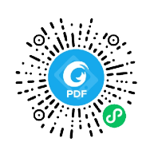    |
| 3  | [Spring Boot 3 之自动配置与注入顺序控制](https://www.foxitsoftware.cn/bhds/payRead/1vzfy1/)     | 付费，有试读章节 | Spring 生态重要知识点，掌握步入微服务的关键开关                                                      |       |
| 4  | [Spring Cloud 之 Session 共享及一致性处理](https://www.foxitsoftware.cn/bhds/payRead/pmq4wy) | 付费，有试读章节 | 深入浅出剖析微服务架构 Session 共享技术难点                                                       |  |
| 5  | [OAuth 2 中的鉴权和动态接口鉴权](https://www.foxitsoftware.cn/bhds/payRead/uxq6fi)             | 付费，有试读章节 | 带您跟随 Dante Cloud 源代码，由浅入深全面掌握 Spring Security 5 & 6 以及基于 OAuth2 的微服务动态接口鉴权的原理与实现 |              |
| 6  | [Spring Boot 3 之 Rest 接口传参方式详解](https://www.foxitsoftware.cn/bhds/payRead/kcsegy)   | 付费，有试读章节 | 一文让你彻底掌握 Spring Boot Rest 各种传参方式和方法的”正确打开方式“                                     |    |

## [8]、安全测试

Dante Cloud 已通过由第三方进行的软件出厂安全测试。详情参见：[安全测试](https://www.herodotus.cn/guide/get-start/project-introduction.html#%E4%BA%94-%E5%AE%89%E5%85%A8%E6%B5%8B%E8%AF%95)

## [9]、授权协议

本项目基于 Apache License Version 2.0 开源协议，可用于商业项目，但必须遵守以下补充条款。

- 不得将本软件应用于危害国家安全、荣誉和利益的行为，不能以任何形式用于非法为目的的行为。
- 在延伸的代码中（修改现有源代码衍生的代码中）需要带有原来代码中的协议、版权声明和其他原作者 规定需要包含的说明（请尊重原作者的著作权，不要删除或修改文件中的Copyright和@author信息） 更不要，全局替换源代码中的 Dante Cloud、Herodotus 或 码匠君 等字样，否则你将违反本协议条款承担责任。
- 您若套用本软件的一些代码或功能参考，请保留源文件中的版权和作者，需要在您的软件介绍明显位置 说明出处，举例：本软件基于 Dante Cloud 微服务架构，并附带链接：https://www.herodotus.cn
- 任何基于本软件而产生的一切法律纠纷和责任，均与作者无关。
- 如果你对本软件有改进，希望可以贡献给我们，双向奔赴互相成就才是王道。
- 本项目已申请软件著作权，请尊重开源。

## [10]、参与贡献

1. 在 Gitee fork 项目到自己的 repo
2. 把 fork 过去的项目也就是你的项目 clone 到你的本地
3. 修改代码（记得一定要修改 develop 分支）
4. commit 代码，push 到自己的库（develop 分支）
5. 登录 Gitee 在你首页可以看到一个 pull request 按钮，点击它，填写一些说明信息，然后提交即可。
6. 等待维护者合并

## [11]、如何升级

尽量不修改 Dante Cloud 以外的项目源码，如 Dante Engine、Dante OSS。如果修改了，请 Pull Requests 上来，否则代码与官方不同步，可能会将对你的日后升级增加难度。

每个版本升级，我们都会附带详细更新日志：https://www.herodotus.cn/others/log/changelog.html。 在这里，你可以看到 Dante Cloud 新增哪些新功能和改进。
针对有较大变化、差异的版本，我们都会负载详细的升级指南：https://www.herodotus.cn/guide/get-start/notices.html。 在这里，你可以看到 Dante Cloud 不同版本对应升级方法。

## [12]、交流反馈

- 详见[【在线文档】](https://www.herodotus.cn) 交流反馈章节。

## [13]、界面预览

<table>
    <tr>
        <td>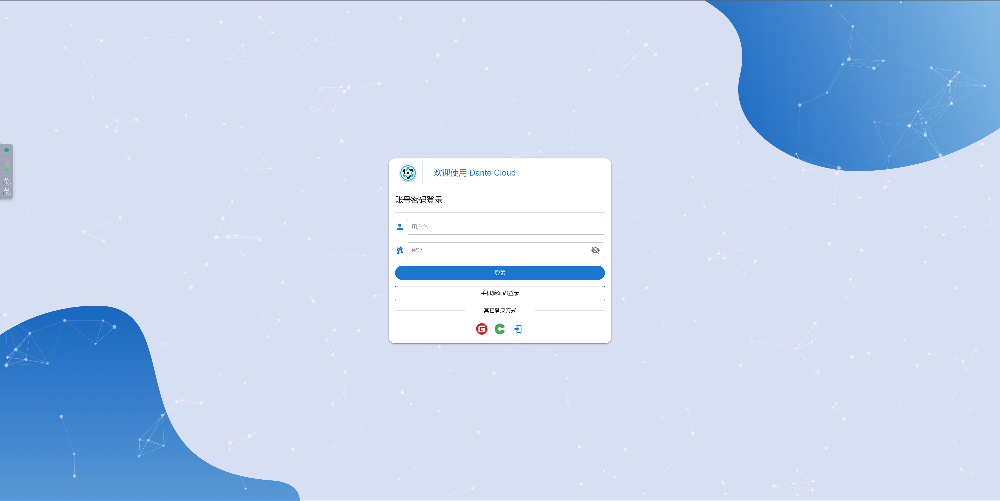</td>
        <td>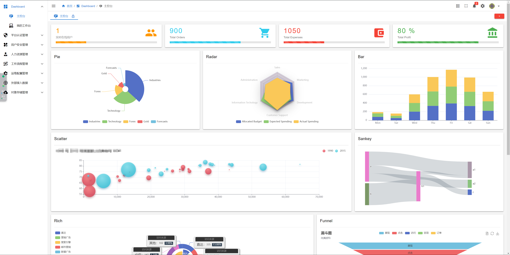</td>
        <td>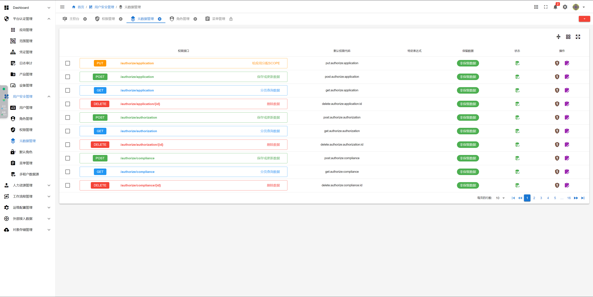</td>
    </tr>
    <tr>
        <td>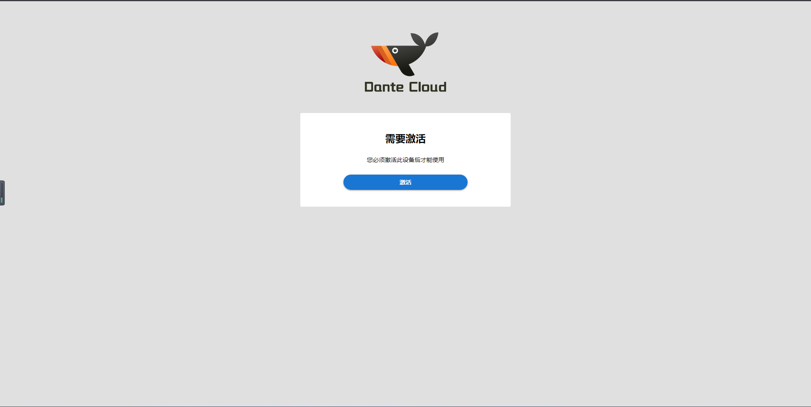</td>
        <td>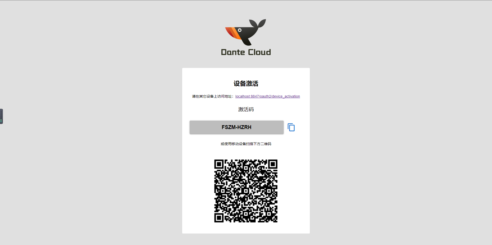</td>
        <td>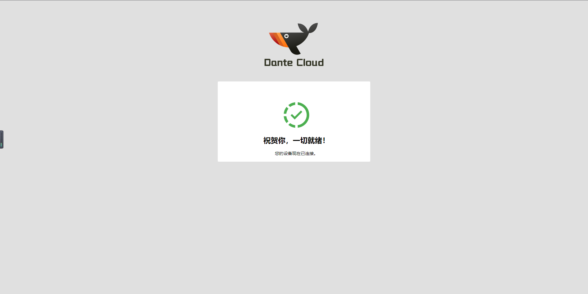</td>
    </tr>
    <tr>
        <td>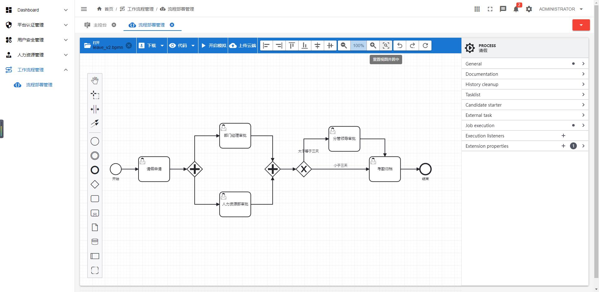</td>
        <td>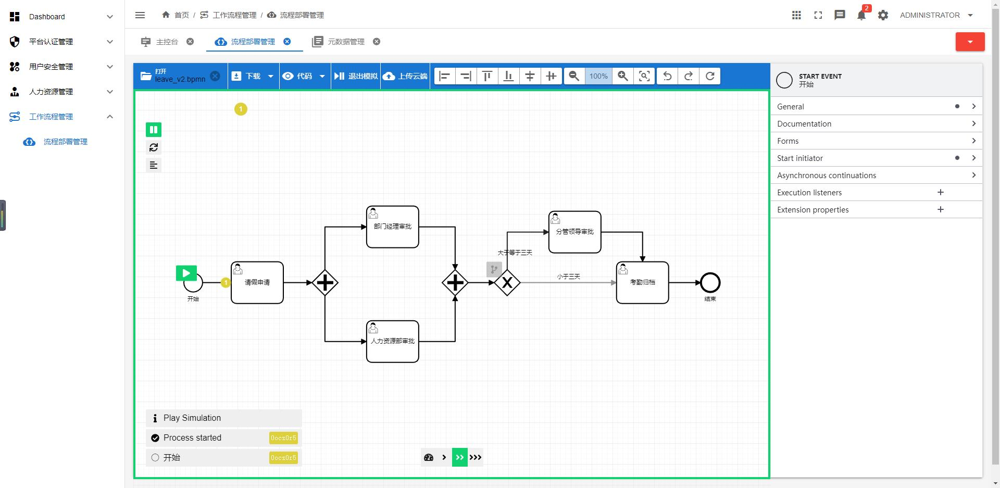</td>
        <td></td>
    </tr>
    <tr>
        <td>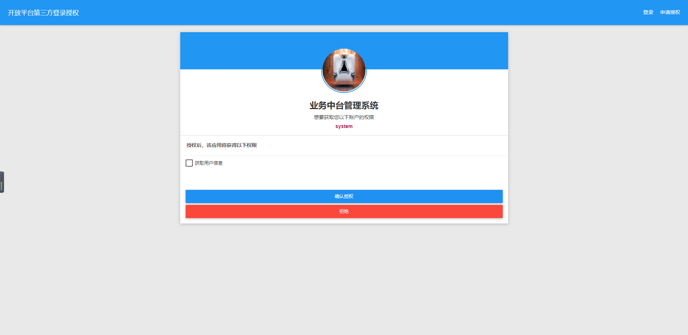</td>
        <td>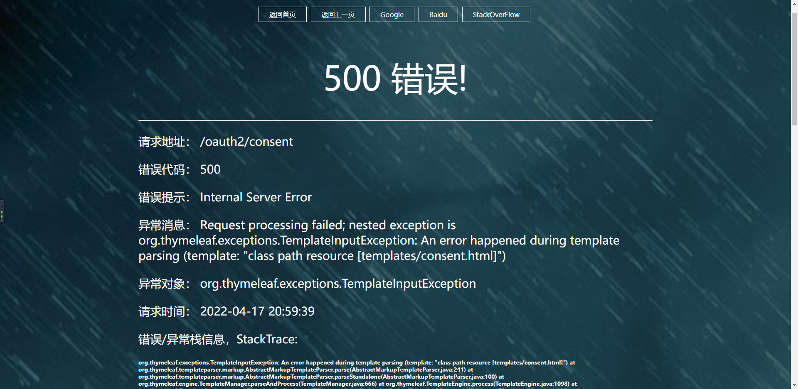</td>
        <td>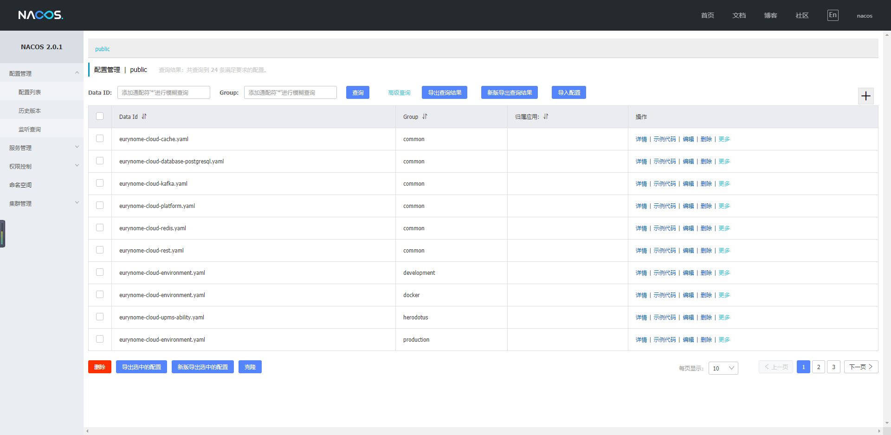</td>
    </tr>
    <tr>
        <td></td>
        <td>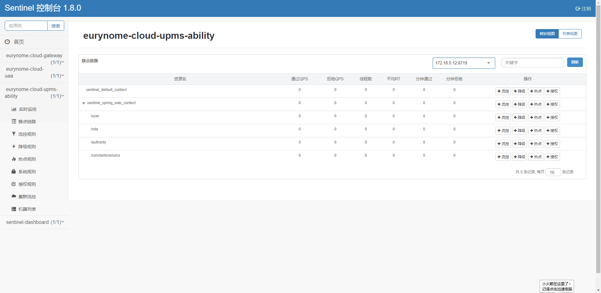</td>
        <td>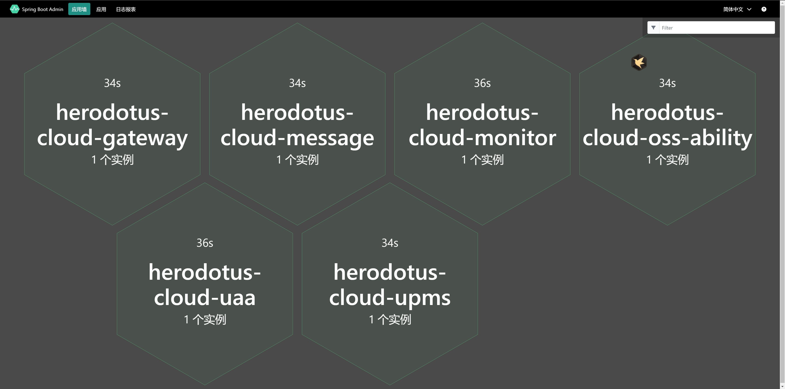</td>
    </tr>
    <tr>
        <td></td>
        <td></td>
        <td></td>
    </tr>
</table>

## [14]、谁在使用 Dante Cloud

| 序号 | 名称   | 官网                      |
|----|------|-------------------------|
| 1  | 轻喜到家 | <https://qxdaojia.com/> |

## [15]、鸣谢

### 赞助人列表

| 序号 |   赞助人    |    赞助时间    | 序号 |     赞助人     |    赞助时间    | 序号 |    赞助人    |    赞助时间    |
|:--:|:--------:|:----------:|:--:|:-----------:|:----------:|:--:|:---------:|:----------:|
| 1  |  ご沉默菋噵   | 2021-10-25 | 2  |    偷土豆的人    | 2021-11-24 | 3  |  lorron   | 2022-04-04 |
| 4  |   在云端    | 2022-12-26 | 5  |     西晽      | 2022-12-27 | 6  | p911gt3rs | 2023-01-03 |
| 7  |  jacsty  | 2023-01-31 | 8  | hubert_rust | 2023-03-16 | 9  |  Zkey Z   | 2023-03-18 |
| 10 |   志国欧巴   | 2023-03-27 | 11 |   michael   | 2023-04-07 | 12 |   大叔丨小巷   | 2023-04-11 |
| 13 | sun_left | 2023-04-19 | 14 | time 丶 sand | 2023-07-06 | 15 |  印第安老斑鸠   | 2023-09-09 |
| 16 |   一阵风    | 2023-12-10 | 17 |    Jack     | 2024-03-01 | 18 |           |            |

### 开源项目

- [Soybean Admin](https://gitee.com/honghuangdc/soybean-admin)
- [Vue Next Admin](https://gitee.com/lyt-top/vue-next-admin)
- [Vue VBen Admin](https://gitee.com/annsion/vue-vben-admin)
- [Quasar Admin Template](https://gitee.com/jinjinge/quasar-admin-template)

### 感谢 JetBrains 提供的免费开源 License


