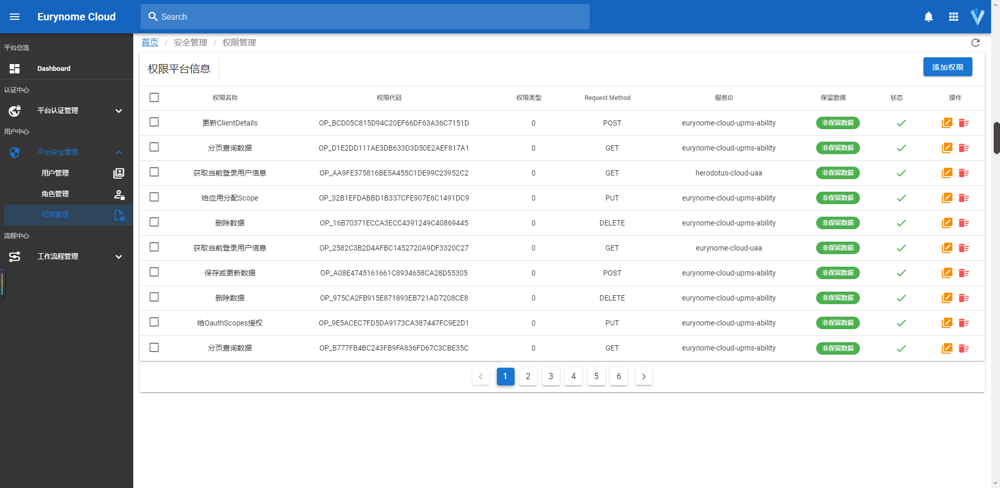
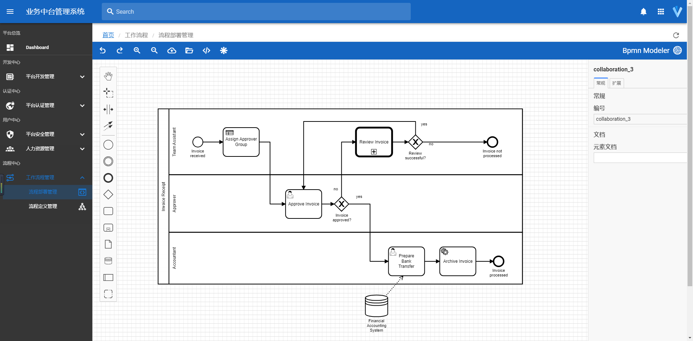
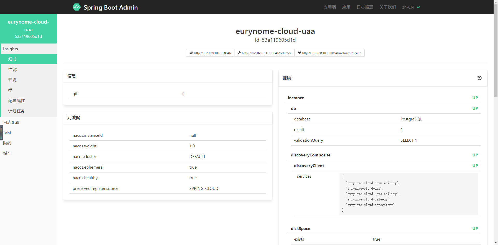

<p align="center"></p>
<h2 align="center">简洁优雅 · 稳定高效 | 宁静致远 · 精益求精 </h2>
<h3 align="center">Eurynome Cloud 微服务架构</h3>

---

<p align="center">
    <a href="https://www.oracle.com/java/technologies/javase-downloads.html" target="_blank"></a>
    <a href="https://spring.io/projects/spring-boot" target="_blank"></a>
    <a href="https://spring.io/projects/spring-cloud" target="_blank"></a>
    <a href="https://github.com/alibaba/spring-cloud-alibaba" target="_blank"></a>
    <a href="https://nacos.io/zh-cn/index.html" target="_blank"></a>
    <a href="./LICENSE"></a>
    <a href="https://blog.csdn.net/Pointer_v" target="_blank"></a>
    <a href="#" target="_blank"></a>
    <a href="https://gitee.com/herodotus/eurynome-cloud"></a>
    <a href="https://gitee.com/herodotus/eurynome-cloud"></a>
</p>

<p align="center">
    <a href="https://github.com/herodotus-cloud/eurynome-cloud">Github 仓库</a> &nbsp; | &nbsp; 
    <a href="https://gitee.com/herodotus/eurynome-cloud">Gitee 仓库</a>
</p>


<h1 align="center"> 如果您觉得有帮助，请点右上角 "Star" 支持一下，谢谢！</h1>

---
## 企业级技术中台微服务架构与服务能力开发平台

Eurynome Cloud是一款企业级微服务架构和服务能力开发平台。基于Spring Boot 2.5.3、Spring Cloud 2020.0.3、Spring Cloud Alibaba 2021.1、Nacos 2.0.3 等最新版本开发，遵循SpringBoot编程思想，高度模块化和可配置化。具备服务发现、配置、熔断、限流、降级、监控、多级缓存、分布式事务、工作流等功能，代码简洁，架构清晰，非常适合学习和企业作为基础框架使用。

## [1]、总体架构


> 部分功能演示，正在逐步添加

### （1） 方法级动态权限


### （2） 服务调用链监控


## [2]、功能介绍

### 统一安全认证中心

| 功能                     | 说明                                                         |
| ------------------------ | ------------------------------------------------------------ |
| OAuth2.0 安全认证        | 支持OAuth2.0授权码模式、隐式授权码模式（简单模式）、密码模式和客户端模式四种登录模式 |
| JWT Token令牌            | 采用JWT对OAuth2 Token进行加密                                |
| 自定义OAuth2页面         | 自定义OAuth2 login、confirm、error页面，提升系统使用用户体验。可结合自身需求进行修改。 |
| OAuth2 登录验证码        | OAuth2登录增加验证码保护，支持gif、中文、算数等类型，可通过配置进行修改以及是否显示验证码控制 |
| OAuth2登录数据加密传输   | 基于AES对OAuth2登录数据进行动态加密传输，可通过配置对表单参数名进行动态配置，提升系统安全性 |
| 平台权限管理             | 基于RBAC模型，以角色和接口为核心，使用统一逻辑实现@PreAuthorize注解权限与URL权限的全面整合及动态可配置化。统一平台接口白名单，IP地址白名单，以及Scope绑定URL的管理。无须配置Security权限注解，支持URL粒度的鉴权和用户权限的动态配置。 完美支持单体式架构、UPMS自身应用需求、分布式架构以及分布式各服务多实例等各种应用场景。完美支持单体式架构、UPMS自身应用需求、分布式架构以及分布式各服务多实例等各种应用场景。             |
| User、Client数据策略访问 | 支持OAuth2 UserDetails、ClientDetails数据直连数据库和Feign两种数据获取策略模式，OAuth2直连数据库性能更优，Feign访问数据服务独立可动态扩展。可通过配置动态修改具体采用哪种策略 |
| 手机短信验证码注册和登录 | 支持通过手机验证码登录认证，与平台为统一体系，统一返回OAuth2 Token，支持服务接口鉴权。 |
| 第三方系统社交注册和登录 | 基于JustAuth实现第三方系统社交登录认证，，与平台为统一体系，统一返回OAuth2 Token，支持服务接口鉴权，。所有JustAuth支持的第三方系统均支持。 |
| 微信小程序注册和登录     | 支持微信小程序登录认证，与平台为统一体系，统一返回OAuth2 Token，支持服务接口鉴权。 |
| 其它注册和登录           | 采用策略模式对外部登录和注册进行支持，目前未支持的登录，可参考标准，动态扩展，即可支持。 |

### 统一服务访问网关

| 功能           | 说明                                                         |
| -------------- | ------------------------------------------------------------ |
| 网关动态路由   | 基于Gateway和Nacos实现服务网关动态路由，无须增加任何配置，即可支持服务的发现与路由 |
| 网关服务鉴权   | 服务网关集成部分权限认证功能，提升系统安全性，降低平台压力   |
| 网关服务限流   | 基于Sentinel实现服务的限流，支持基于Gateway Filter的自定义限流 |
| 动态文档聚合   | 网关动态Swagger文档聚合，使用Swagger 3.0，支持Knife4j增强。不同环境访问控制 |
| 统一跨域处理   | 基于Gateway实现统一跨域处理                                  |
| 统一错误处理   | 平台统一错误处理，支持自定义错误码体系                       |
| 自定义动态路由 | 支持基于DB的动态路由管理与路由规则配置                       |

### 微服务架构支撑

| 功能         | 说明                                                         |
| ------------ | ------------------------------------------------------------ |
| 服务注册发现 | 基于Nacos实现服务的注册与发现。                              |
| 服务负载均衡 | Spring Cloud Netflix停止维护，使用Spring Cloud Loadbalancer全面替换Ribbon， |
| 服务熔断降级 | 整合OpenFeign和Sentinel，从熔断降级、系统负载保护、热点防护等多个维度来保障微服务的稳定性 |
| 统一配置中心 | 基于Nacos搭建的统一配置中心，使用MySQL8，支持配置文件自动导入和关键信息加密，可根据文件夹名称自动分组配置。 |
| 统一日志中心 | 采用TCP直连的方式采集和发送日志，集成Skywalking TraceID实现日志聚合及ELK日志分析。通过@EnableXXX注解开启或关闭日志采集功能。 |
| 分布任务调度 | 极简集成xxl-job，支持分布式任务调度功能                      |
| 分布事务处理 | 集成Seata，支持分布式事务，无代码侵入，灵活便捷              |
| 分布对象存储 | 支持Minio分布式对象存储。同时，集成阿里云OSS，可通过@EnableXXX注解开启或关闭功能。 |
| 分布式工作流 | 以Camunda引擎为基础定义分布式工作流引擎，提供自研人事信息管理以及人事管理体系与工作流用户体系的实时集成 |

### 微服务运行监控

| 功能           | 说明                                                         |
| -------------- | ------------------------------------------------------------ |
| 服务调用链监控 | 集成Skywalking进行服务调用链的监控，调用链监控深度可延伸至Undertow、数据库、Redis |
| 应用吞吐量监控 | 集成Skywalking进行应用吞吐量监控                             |
| 熔断、降级监控 | 集成Sentinel进行服务的熔断、降级监控                         |
| 微服务状态监控 | 集成Spring Boot Admin进行服务运行状态的监控                  |

### 数据自动化处理

| 功能                | 说明                                                         |
| ------------------- | ------------------------------------------------------------ |
| 数据模型初始化      | RBAC、OAuth2部分核心表、Camunda数据表，在初始部署过程中为自动化创建 |
| 核心应用数据初始化  | RBAC、OAuth2等核心数据，在初始部署过程中为自动化导入         |
| URL权限数据动态汇总 | 自动扫描URL接口作为权限汇总存入系统，根据URL相关信息生成唯一ID，多次导入数据不会重复。可通过配置动态开启或修改扫描内容 |
| Yml配置自动导入     | 服务所需使用的配置文件，可自动根据文件夹进行分组并导入到Nacos中。 |

### 服务开发支撑

| 功能             | 说明                                                         |
| ---------------- | ------------------------------------------------------------ |
| 通用CRUD封装     | 各种类型的代码生成器较多，结合实际应用使用效果来看，代码生成器在实际开发中使用频率低于理想预期。因此，没有考虑提供代码生成器，而是对常规的CRUD进行了多层次的封装，使定制化服务的开发更加便捷。 |
| 自研两级缓存封装 | 自研基于Caffeine和Redis分布式两级缓存,完美支持JPA Hibernate二级缓存,完美支持各类查询数据缓存以及JPA @ManyToMany, @ManyToOne等关联查询。实现基于Caffeine的Hibernate二级缓存，可与自研两级缓存快速切换，仅使用本地缓存创建Key繁琐和分页数据无法更新的问题 |
| 多类型数据库支持 | 默认采用postgresql数据库，支持MySQL、Oracle、H2等多种关系型数据库，无须修改代码可动态切换。数据层同时支持Spring Data Jpa和Mybatis |
| 多消息队列支持   | 适配RabbitMQ和Kafka，默认使用Kafka，支持消息总线(Spring Cloud Bus) |
| 多种服务调用方式 | 默认采用OpenFeign进行服务间调用，支持RestTemplate和OkHttps   |
| 共享式多环境切换 | 共享式、统一化多环境配置模式，Yml、Docker均采用此方式配置，避免类似的服务配置、Dockerfile配置导出复制和修改的问题 |
| 多团队开发管理   | 支持多团队开发，可针对各个团队开发服务，进行单独的授权配置。 |
| 注解模型模块模式 | 除必要依赖逻辑以及强注入顺序要求的模块采用Spring SPI（spring.factories）机制外，其它功能模块均采用@EnableXXX注解编程模型，可选择性进行控制是否开启对应模块，减少不必要的依赖注入和启动。 |
| 代码打包记录查询 | 对代码编译信息进行记录，可查询代码版本以及编译时间等相关信息，方便运维人员更好的掌握代码信息。 |
| 人事信息管理 | 除已有的用户体系外，集成单位、部门、人员等人事管理功能，满足大多数人事管理场景，并与Camunda工作流用户体系无缝整合，实现数据实时同步 |

### 信息发送集成

| 功能               | 说明                                                         |
| ------------------ | ------------------------------------------------------------ |
| 微信小程序订阅消息 | 支持微信小程序订阅消息发送。提供订阅消息模版工厂，可根据自身业务需求，编写少量代码既可以拓展支持新订阅消息模版。 |
| 极光消息推送集成   | 集成极光消息推送，对极光后台API进行封装，封装度高、调用方便，可快速与自定义业务需求整合，通过@EnableXXX注解开启或关闭。 |
| 环信消息集成       | 集成环信IM和消息推送，使用更加便捷，可在应用中根据自定义需求快速整合和拓展IM，发送手机推送消息。通过@EnableXXX注解开启或关闭。 |
| 多通道SMS集成      | 集成阿里、百度、中国移动、华为、京东、极光、网易、七牛、腾讯、又拍、云片等平台短信发送通道。可通过配置动态选择具体使用通道。支持多模版定义以及模版参数顺序控制 |

### 内容审核集成

| 功能               | 说明                                                         |
| ------------------ | ------------------------------------------------------------ |
| 阿里云内容审核     | 集成阿里云内容审核，支持文本、图片、音频、视频、网页内容审核，支持同步审核、异步审核、异步Callback方式审核通过@EnableXXX注解开启或关闭。 |
| 微信小程序内容审核 | 集成微信小程序内容审核，支持文本、图片、音频内容审核，支持同步、异步审核。通过@EnableXXX注解开启或关闭。 |
| 百度证照识别       | 集成百度证照审核，支持营业执照、身份证OCR识别。通过@EnableXXX注解开启或关闭。 |
| 天眼查企业信息查询 | 集成天眼查企业信息查询。通过@EnableXXX注解开启或关闭。       |

## [3]、技术栈和版本说明

### （1）Spring全家桶及核心技术版本
  
组件 | 版本 
---|---
Spring Boot | 2.5.3
Spring Cloud | 2020.0.3 
Spring Cloud Alibaba | 2021.1
Spring Boot Admin | 2.4.2
Nacos | 2.0.3 |
Sentinel | 1.8.0 |
Seata | 1.3.0 |

> Spring 全家桶版本对应关系，详见：[版本说明](https://github.com/alibaba/spring-cloud-alibaba/wiki/%E7%89%88%E6%9C%AC%E8%AF%B4%E6%98%8E)

### （2）所涉及的相关的技术： 

* JSON序列化：Jackson & FastJson 
* 消息队列：Kafka 适配RabbitMQ，支持消息总线(Spring Cloud Bus)
* 数据缓存：JetCache + Redis + Caffeine 
* 数据库： Postgresql，MySQL，Oracle ...
* 前端实现：Vue + Vuetify
* 持久层框架： Spring Data Jpa & Mybatis
* API网关：Gateway
* 服务注册&发现和配置中心: Nacos 
* 服务消费：OpenFeign & RestTemplate & OkHttp3
* 负载均衡：Spring Cloud Loadbalancer
* 服务熔断&降级&限流：Sentinel
* 分布式事务：Seata
* 服务监控：Spring Boot Admin
* 链路跟踪：Skywalking
* 文件服务：阿里云OSS/Minio
* 数据调试：p6spy
* 日志中心：ELK
* 日志收集：Logstash Logback Encoder

## [4]、 版本号说明

本系统版本号，分为四段。

- 第一段和第二段，与Spring Boot 版本对应，根据采用的Spring Boot版本变更。例如，当前采用Spring Boot 2.4.6版本，那么就以2.4.X.X开头
- 第三段，表示系统功能的变化
- 第四段，表示系统功能维护及优化情况

## [5]、工程结构

``` 
eurynome-cloud
├── configurations -- 配置文件脚本和统一Docker build上下文目录
├── dependencies -- 工程Maven顶级依赖，统一控制版本和依赖
├── documents -- 工程相关文档
├── packages -- 基础通用依赖包
├    ├── eurynome-cloud-common -- 公共工具类
├    ├── eurynome-cloud-data -- 数据持久化、数据缓存以及Redis等数据处理相关代码组件
├    ├── eurynome-cloud-rest -- Rest相关代码组件
├    ├── eurynome-cloud-crud -- CRUD相关代码组件
├    ├── eurynome-cloud-sercurity -- Security通用代码
├    ├── eurynome-cloud-oauth -- OAuth2通用代码
├    ├── eurynome-cloud-message -- 消息队列、BUG相关代码组件
├    ├── eurynome-cloud-kernel -- 微服务接入平台必备组件
├    ├── eurynome-cloud-oauth-starter -- 自定义OAuth2 Starter
├    └── eurynome-cloud-starter -- 微服务核心Starter
├── platform -- 平台核心服务
├    ├── eurynome-cloud-gateway -- 服务网关
├    ├── eurynome-cloud-management -- Spring Boot Admin 监控服务
├    └── eurynome-cloud-uaa -- 统一认证模块
├── services -- 平台业务服务
├    ├── eurynome-cloud-upms-api -- 通用用户权限api 
├    ├── eurynome-cloud-upms-logic -- 通用用户权限service
├    ├── eurynome-cloud-upms-rest -- 通用用户权限rest 接口
├    ├── eurynome-cloud-upms-ability -- 通用用户权限服务
└──  └── eurynome-cloud-bpmn-ability -- 工作流服务 
```

## [6]、项目地址
* 后端Gitee地址：[https://gitee.com/herodotus/eurynome-cloud](https://gitee.com/herodotus/eurynome-cloud)
* 后端Github地址：[https://github.com/herodotus-cloud/eurynome-cloud](https://github.com/herodotus-cloud/eurynome-cloud)
* 单体版示例工程：[https://gitee.com/herodotus/eurynome-cloud-athena](https://gitee.com/herodotus/eurynome-cloud-athena)
* 前端Gitee地址：[https://gitee.com/herodotus/eurynome-cloud-ui](https://gitee.com/herodotus/eurynome-cloud-ui)

## [7]、用户权益
* 允许免费用于学习、毕设、公司项目、私活等。
* 遵循Apache-2.0开源协议

## [8]、交流反馈
* 欢迎提交[ISSUS](https://gitee.com/herodotus/eurynome-cloud/issues) ，请写清楚问题的具体原因，重现步骤和环境(上下文)
* 博客：https://blog.csdn.net/Pointer_v
* 邮箱：herodotus@aliyun.com
* QQ群：922565573

## [9]、界面预览
<table>
    <tr>
        <td></td>
        <td></td>
    </tr>
    <tr>
        <td></td>
        <td></td>
    </tr>
    <tr>
        <td></td>
        <td></td>
    </tr>
    <tr>
        <td></td>
        <td></td>
    </tr>
    <tr>
        <td></td>
        <td></td>
    </tr>
    <tr>
        <td></td>
        <td></td>
    </tr>
</table>
